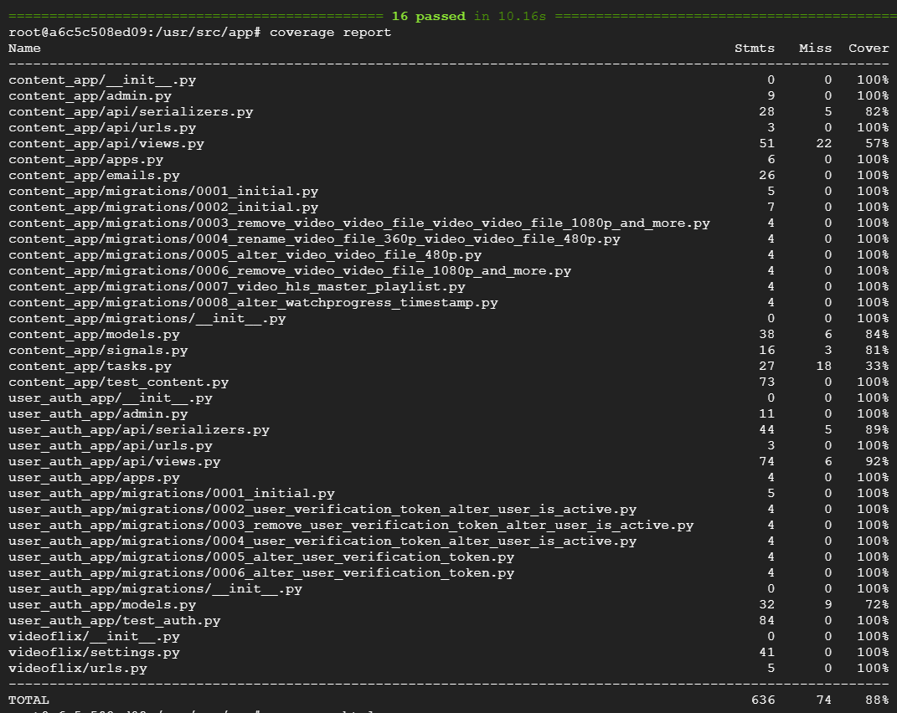

#  Videoflix – Deine eigene Video-Plattform

Videoflix ist eine Streaming-Plattform, die es erlaubt, Videos hochzuladen, zu streamen und den Fortschritt beim Schauen zu speichern.  
Das Projekt wurde mit **Django** umgesetzt und nutzt **Docker**, **Redis** und **PostgreSQL** im Hintergrund.

> 🔗 **Live-Demo:** [https://web.videoflix.rio-stenger.de]
> *(Frontend und Backend sind online und verbunden.)*

---

## 🚀 Features

- 🔐 Benutzerregistrierung & Login mit E-Mail-Verifizierung
- 📹 Video-Upload inkl. automatischer Verarbeitung & HLS-Streaming
- 📊 Fortschritts-Speicherung beim Anschauen
- 🔁 Hintergrundjobs mit RQ (z. B. für Video-Konvertierung)
- 🔌 Vollständige REST-API für Integration mit Frontend oder Clients
- 🐳 Dockerisierte Umgebung für Entwicklung & Deployment
- ✅ Tests mit `pytest` und `coverage.py` implementiert

---

## 🛠️ Technologien

- **Backend:** Django, Django REST Framework
- **Task-Queue:** Redis + Django-RQ
- **Datenbank:** PostgreSQL
- **Containerisierung:** Docker, Docker Compose
- **Tests:** Pytest, Coverage.py
- **Deployment:** Docker-Setup auf V-Server (Ubuntu)

---

## 🚀 Installation und Start

Dieses Projekt ist primär für den produktiven Servereinsatz konzipiert.
Die Erstellung der Anwendung lokal ist in der Regel nicht notwendig, da vorkompilierte Docker-Images auf Docker Hub bereitstehen:

- **Backend Docker Image:** [`rio96/videoflix`](https://hub.docker.com/repository/docker/rio96/videoflix/general)
- **Worker Docker Image:** [`rio96/videoflix-worker`](https://hub.docker.com/repository/docker/rio96/videoflix-worker/general)

### ⚙️ Voraussetzungen

Bevor du startest, stelle sicher, dass folgende Software installiert ist:

- **Docker:** Version 20.x oder höher
- **Docker Compose:** Version 1.29 oder höher
- **Git**

---

### 1. Docker-Images herunterladen

Verwende die folgenden Befehle, um die benötigten Docker-Images herunterzuladen:

```bash
docker pull rio96/videoflix
docker pull rio96/videoflix-worker
```

### ▶️ 2. Anwendung starten

Um die Anwendung zu starten, nutze **Docker Compose**. Stelle sicher, dass du die erforderlichen Konfigurationsdateien wie `docker-compose.yml` und `nginx.conf` aus dem GitHub-Repository heruntergeladen hast.

### Repository klonen und in das Verzeichnis wechseln

Klonen **des** GitHub-Repositories, um die Konfigurationsdateien zu erhalten, und wechsle in das Verzeichnis:
```bash
git clone [https://github.com/Rio741/new-videoflix-backend.git](https://github.com/Rio741/new-videoflix-backend.git)
```
```bash
cd videoflix
```

### Docker-Container im Hintergrund starten

Starte die Anwendung und alle notwendigen Dienste im Hintergrund:

```bash
docker-compose up -d
```
---

## 🧪 **Testabdeckung:**  
-   

- Aktuell bei **88 %** – Ziel: 80 %+